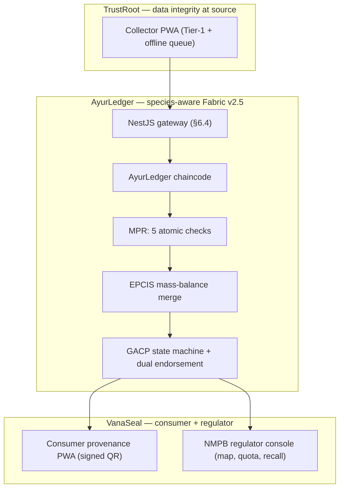

# AyurTrace

**Enforcement infrastructure for India's Ayurvedic herb supply chain.** SmartHorizon
International Hackathon · problem statement **SH-HLT-10**.

AyurTrace records a herb's journey from collection to formulation on a permissioned
Hyperledger Fabric ledger using the **GS1 EPCIS 2.0** event model, and — unlike generic
traceability platforms that only *log* movements — encodes NMPB geo-fences, conservation
quotas, and GACP checkpoints **directly in chaincode**, so a non-compliant collection or a
diluted batch is **rejected at commit time and permanently attributed to its actor**.

> We claim compliance is **detectable, attributable, and enforced at checkpoints** — not
> "impossible to commit." That distinction is deliberate and defended in the solution doc.

---

## Honest status matrix

Every capability is tagged. Nothing designed is presented as working software.

| Capability | Status | Evidence |
|---|---|---|
| Frozen EPCIS 2.0 contracts (`@ayurtrace/contracts`) | 🟢 **BUILT** | compiles under `strict` + `noUncheckedIndexedAccess` |
| MPR chaincode — 5 atomic checks (geo-fence, season, quota, license, part) | 🟢 **BUILT** | 45/45 unit + golden-path tests pass |
| EPCIS `TransformationEvent` mass-balance (N→1 merge) | 🟢 **BUILT** | dilution → `MASS_BALANCE_VIOLATION` in tests |
| GACP checkpoints CP-1/2/4/7 + dual endorsement | 🟢 **BUILT** | tested; incentive-independent verifier enforced |
| GACP score 0–100 + recall traversal (merge → source farms) | 🟢 **BUILT** | tested |
| Fabric `Contract` adapter (`ChaincodeStub` → `LedgerPort`) | 🟢 **BUILT** | type-checks against `fabric-contract-api` 2.5 |
| NestJS gateway (§6.4 endpoints, validation, typed rejects, ed25519 QR) | 🟢 **BUILT** | 14/14 HTTP checks pass end-to-end |
| Collector PWA · Consumer PWA · Regulator dashboard | 🟢 **BUILT** | live against gateway; bundled real-data fallback |
| Tier-2 offline queue | 🟡 **SIMULATED** | queue UI real; sync shown via a signal toggle |
| IoT weighbridge (CP-3), PoLK peer confirm, species photo-check | 🟡 **SIMULATED** | real interface, mocked backend |
| Live 3-org Fabric network run | 🔵 **DESIGNED** | `FabricLedgerBackend` written; needs `fabric-samples` + Docker (see `infra/`) |
| CP-5/CP-6 live enforcement, IPFS/RFC-3161, Tier-3 SMS, Tier-4 CFA, export bundle | 🔵 **DESIGNED** | architecture only, per execution plan §1.4 |

**Why the live Fabric run is DESIGNED, not BUILT here:** the chaincode + the Fabric adapter
are complete and type-check against the real SDK, but a live peer needs Docker and
`fabric-samples`, which this build environment can't run. The **in-memory demo backend runs
the identical enforcement service**, so every reject code and state transition you see is
the real chaincode logic — not a mock.

---

## Architecture



The gateway depends only on a `LedgerBackend` port. `LEDGER_BACKEND=demo` runs everything on
one machine with no network; `LEDGER_BACKEND=fabric` connects to a real peer. Switching is
one env var — controllers, UIs, and contracts never change.

---

## Run it

Prerequisites: Node 20+ and npm.

```bash
# 1. contracts + seed + chaincode
(cd packages/contracts && npm install && npm run build)
(cd seed && npm install && npm run build)
(cd chaincode/ayurledger && npm install && npm test)     # → 45/45 pass

# 2. gateway (demo backend — no Docker needed)
(cd apps/gateway && npm install && npm run build)
(cd apps/gateway && LEDGER_BACKEND=demo PORT=3001 npm start)

# 3. open the UIs (any static server, or open the files directly)
#    apps/consumer-pwa/index.html   — scan/verify a product QR
#    apps/collector-pwa/index.html  — log a field collection
#    apps/regulator/index.html      — zones, quotas, one-click recall
```

The UIs auto-detect the gateway on `http://localhost:3001`. If it isn't running they render
from **bundled real captured responses**, so they're demonstrable offline (a chip shows
which mode is active).

Replay the full §9.1 golden path against a running gateway:

```bash
(cd apps/gateway && node golden-path.mjs)        # 14 checks: valid commit → rejects → merge → QR → recall
./scripts/reset-demo.sh             # deterministic re-seed for repeat dry runs
```

To run on real Fabric, see `infra/README.md`, then start the gateway with
`LEDGER_BACKEND=fabric` and the enrollment env vars.

---

## Repository layout

```
packages/contracts   Frozen EPCIS types, reject codes, API DTOs, composite keys (single source of truth)
chaincode/ayurledger MPR enforcement (pure, unit-tested) + Fabric Contract adapter + in-memory ledger
apps/gateway         NestJS §6.4 REST facade, edge validation, typed rejects, ed25519 QR, 2 backends
apps/collector-pwa   Field entry PWA — pictographic Tier-1, GPS zone-only, offline queue, reject-code UI
apps/consumer-pwa    Provenance PWA — QR verify, GACP ring, provenance thread, source-farm traceback
apps/regulator       NMPB console — zone map, quota bands, over-harvest alerts, one-click recall
seed                 Deterministic reference data (5 species, 3 zones, 4 collectors, quotas)
scripts              golden-path replay + reset-demo
infra                DESIGNED 3-org Fabric network notes
```

## Test evidence

- `chaincode/ayurledger` — **45/45** (`npm test`): a passing + failing case for every MPR
  check, mass balance, endorsement, CP-7 gate, GACP score, and the full golden path.
- `apps/gateway` — **14/14** HTTP checks (`(cd apps/gateway && node golden-path.mjs)`): valid commit,
  `ZONE_VIOLATION`, `PART_VIOLATION`, 400 validation, N→1 merge, `MASS_BALANCE_VIOLATION`,
  `ENDORSEMENT_MISSING`, dual-endorsed pass, signed QR mint, genuine + tampered QR verify,
  timeline, quota band, recall to both source farms.
