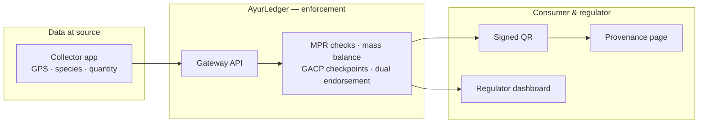

<div align="center">

# 🌿 AyurTrace

### Blockchain-based botanical traceability for India's Ayurvedic herbs

*From the moment a herb leaves the earth to the moment it reaches a consumer's hands — verifiable, tamper-evident, and enforced at every step.*


</div>

---

## Overview

India's Ayurvedic herb supply chain links smallholder farmers, wild collectors, brokers, processors, testing labs, and manufacturers — most working in isolation with no shared, trustworthy record. The result is **species adulteration, invisible origins, over-harvesting of endangered plants, and no verifiable proof for consumers or exporters.**

**AyurTrace** records a herb's entire journey on a permissioned blockchain using the global supply-chain standard **GS1 EPCIS 2.0** — and, unlike generic traceability platforms that merely *log* that a movement happened, it encodes **NMPB geo-fence zones, species conservation quotas, and GACP quality checkpoints directly into the ledger logic.**

> A non-compliant collection or a diluted batch is **rejected the instant it is submitted, and permanently attributed to the actor who tried it** — not discovered weeks later.

| The problem | How AyurTrace answers it |
|---|---|
| Species substitution & adulteration | DNA barcode checkpoint + dual-endorsed lab tests before a product can be made |
| Unknown / illegal origin | GPS geo-fencing against approved NMPB zones, checked at collection time |
| Brokers mixing many farms → "source lost forever" | A **mass-balance merge** that keeps every input lot linked with its proportion |
| Over-harvesting endangered species | Per-species, per-zone annual **quotas enforced in the ledger** |
| No consumer proof | A signed QR that opens a clean, verifiable provenance page on any phone |

---

## What you can do with it

The whole product runs on your machine and is served from a single URL. Each role signs in from a simple login screen, then sees only its own tools:

| Screen | Who it's for | What it does |
|---|---|---|
| **Overview** | everyone | Live system status and links to every role |
| **Collector** | field collectors | Log a harvest (with an on-device species photo-check) and watch the 5 compliance checks pass — or reject with a clear reason |
| **Lab** | accredited labs | Record quality-test results (auto-filled from a lab report) and DNA species confirmation |
| **Supply chain** | aggregators & manufacturers | Aggregate, mass-balance merge, formulate a product, and generate its signed QR |
| **Regulator** | NMPB / AYUSH | Live zone-quota map, over-harvest alerts, full audit trail, and one-click recall to source |
| **Consumer** | the public | Scan a product QR → a clean authenticity page: genuine badge, quality score, and plain-language journey |

Everything you see is computed live by the server from real ledger data — **no mock data, no fake screens.**

---

## How it works



The same enforcement logic runs in three interchangeable modes behind one interface, so you can demo locally today and move to a real blockchain when ready:

| Mode | What it is | Needs |
|---|---|---|
| `demo` | In-memory, deterministic — used by the automated tests | nothing |
| `live` | **Durable file-backed ledger, real timestamps** — the product demo | nothing |
| `fabric` | A real **Hyperledger Fabric v2.5** network | Docker (see [`infra/fabric/`](infra/fabric)) |

The business rules are **identical** in all three — only the storage layer changes.

---

## Repository structure

```
Ayurtrace/
├── packages/contracts/   Shared types: EPCIS 2.0 events, reject codes, GACP states, API contracts
├── chaincode/ayurledger/ The enforcement engine (smart-contract logic) + its unit tests
├── seed/                 Reference data: species, NMPB zones, collectors, quotas
├── apps/gateway/         REST API server (NestJS) — also serves the dashboards
│   └── web/              The live dashboards (login, collector, lab, supply chain, regulator, consumer)
├── complete-b/           Advanced layer: SMS, RFC-3161 timestamps, RBAC, analytics, IoT, DNA checkpoints
├── infra/fabric/         Scripts to run the chaincode on a real Hyperledger Fabric network
├── docs/                 Data sources, credentials, and design decisions
└── apps/{collector,consumer,regulator}-pwa/   Early standalone prototypes (design reference)
```

---

## Getting started

### Prerequisites
- **Node.js 18 or newer** and **npm** — that's all you need for the local product (no Docker required).

### 1. Install and build

Run once from the project root:

```bash
# shared library
(cd packages/contracts && npm install && npm run build)
# reference data
(cd seed && npm install && npm run build)
# enforcement engine
(cd chaincode/ayurledger && npm install && npm run build)
# API server + dashboards
(cd apps/gateway && npm install && npm run build)
```

### 2. Run it

```bash
cd apps/gateway && npm run start:live
```

Then open **http://localhost:3001** in your browser.

That's the whole product — five dashboards served from one server, backed by a durable ledger. Data you enter persists across restarts. To reset to a clean state, send a `POST` to `/admin/reset-demo` or delete `apps/gateway/data/`.

### 3. Walk the full journey (2 minutes)

1. **Collector** → log an Ashwagandha collection (watch the 5 checks pass; try an off-zone point to see it rejected).
2. **Lab** → record a passing quality test (lab + regulator co-sign, with DNA confirmation).
3. **Supply chain** → *Merge* the lot, *Formulate* a product, then **Generate QR** for it.
4. **Consumer** → scan that QR (or open the link) → a clean "Genuine Product" page with the full farm-to-shelf story.

> **Scanning from a phone:** the phone and laptop must be able to reach each other. On a normal/home Wi-Fi, open the dashboards at your laptop's LAN address (e.g. `http://192.168.x.x:3001`). On restricted networks (campus/office), use a tunnel such as `npx cloudflared tunnel --url http://localhost:3001` and open the dashboards at the public URL it prints — then any phone on any network can scan.

---

## Testing

```bash
(cd chaincode/ayurledger && npm test)                 # 45 enforcement tests
(cd apps/gateway && LEDGER_BACKEND=demo npm run golden-path)   # 14 end-to-end API checks
(cd complete-b && npm install && npm test)            # 169 advanced-layer tests
```

**228 automated tests** cover every compliance rule, the mass-balance merge, dual endorsement, the GACP score, recall traversal, and the full demo journey.

---

## Optional: go further

<details>
<summary><b>Run on a real Hyperledger Fabric network</b> (needs Docker)</summary>

The chaincode and gateway adapter are ready to run on a real peer. With Docker installed, the reproducible scripts in [`infra/fabric/`](infra/fabric) stand up a Fabric v2.5 test-network, deploy the chaincode, and point the gateway at it (`LEDGER_BACKEND=fabric`). See [`infra/fabric/README.md`](infra/fabric/README.md).
</details>

<details>
<summary><b>Enable live SMS and IPFS anchoring</b> (needs free API keys)</summary>

Copy [`.env.example`](.env.example) to `.env`, add a Pinata (IPFS) and/or Twilio (SMS) key, and the mocked paths become real. Step-by-step in [`docs/CREDENTIALS.md`](docs/CREDENTIALS.md).
</details>

<details>
<summary><b>FHIR interoperability</b></summary>

Storage uses GS1 EPCIS 2.0, but any batch can be projected to HL7 FHIR R4 on demand: `GET /fhir/Provenance/:epc` and `GET /fhir/metadata`.
</details>

---

## Tech stack

- **Blockchain:** Hyperledger Fabric v2.5 (chaincode in TypeScript), CouchDB world state
- **Event model:** GS1 EPCIS 2.0 (JSON-LD)
- **API:** NestJS (TypeScript), class-validator, ed25519-signed QR tokens
- **Frontend:** self-contained HTML/CSS/JS dashboards, server-side QR (SVG)
- **Advanced layer:** RFC-3161 trusted timestamps, DNA-barcode checkpoints, 7-role RBAC, Twilio SMS, IPFS pinning

---

## Documentation

| Doc | What's in it |
|---|---|
| [`docs/DATA_SOURCES.md`](docs/DATA_SOURCES.md) | Where the reference data comes from and how to replace it with official NMPB figures |
| [`docs/DECISIONS.md`](docs/DECISIONS.md) | Key design decisions and the reasoning behind them |
| [`docs/CREDENTIALS.md`](docs/CREDENTIALS.md) | How to switch SMS and IPFS from mocked to live |
| [`HANDOFF.md`](HANDOFF.md) · [`FILE_MANIFEST.md`](FILE_MANIFEST.md) | Detailed build state and a file-by-file map |

---

## Status

Every capability is tagged honestly: 🟢 **built and runnable**, 🟡 **real interface, mocked input**, 🔵 **designed, needs external infrastructure**.

- 🟢 Enforcement engine, gateway API, all five dashboards, durable ledger, signed QR + consumer page, 228 tests
- 🟡 Offline collection queue, IoT weighbridge, PoLK peer confirmation (real interfaces, simulated inputs)
- 🔵 Live 3-org Fabric network (ready, needs Docker), live SMS/IPFS (ready, need keys)

---

<div align="center">

*Built for the SH-HLT-10 problem statement. Aligns with the AYUSH Mission and NMPB GACP standards, and UN SDGs 3, 12 & 15.*

**MIT Licensed**

</div>
