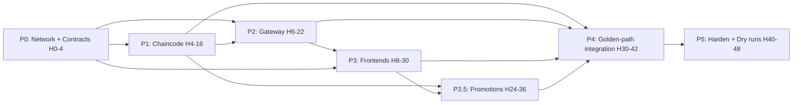

# AyurTrace — Complete Hackathon Execution Plan (No-Code, v2)
### SmartHorizon International Hackathon · SH-HLT-10 · Blockchain-Based Botanical Traceability
### 5-person team · **48-hour** window · vibe-coding workflow

> **Change from v1:** rescaled 36h → **48h**. The extra 12 hours are spent on a short
> **promotion list** (§1.2), a bigger integration buffer, and multiple dry runs — **not** on new
> DESIGNED features. Build is **feature-frozen by H36**; H36–48 is hardening + rehearsal.
> Rest rotation is now a **two-night** model (see `AyurTrace_Team_Schedule_v2_48h.md`).
>
> **Source of truth:** `International_hackathon_solution_v2.md` + `The_complete_problem_statement.md`.
> This plan never contradicts them. Gap-fills tagged `[ASSUMPTION]`.

---

## Section 0 — How to Read This Plan

### 0.1 The generate-per-hour workflow
1. This file + the schedule file live in project memory.
2. You ask: *"Generate Phase 1, Hour 6–8, Person A."*
3. Claude generates production code for that slice **against the frozen contracts in §6**.
4. Every slice imports `@ayurtrace/contracts` and honours §6.4 endpoints. Non-negotiable — it's what stops integration failing silently at H34.

### 0.2 The 48-hour shape (read this before anything else)
The build is sized by **task**, not by available time, so it does not stretch to fill 48h. The
timeline is therefore: **~34h of build (H0–36), then 12h of de-risking (H36–48).**

| Block | Hours | Purpose |
|---|---|---|
| Build | H0–36 | Same core as a 36h plan, plus the §1.2 promotions |
| **Feature freeze** | **H36** | No new features after this line |
| De-risk | H36–48 | Integration buffer, `reset-demo` determinism, 3 dry runs, backup recording, protected rest |

**The trap:** using H36–48 to add features. Don't. A polished, rehearsed core beats a broader
buggy one every time — doubly so in front of an international panel.

---

## Section 1 — Scope: What You Build in 48 Hours

### 1.1 BUILD — the demoable core (must work live)
| # | Component | Doc ref |
|---|---|---|
| B1 | Fabric network: 3 orgs + regulator read-node | §2 |
| B2 | **MPR chaincode — 5 atomic checks** (the crown jewel) | §2B |
| B3 | **EPCIS 2.0 event model** (ObjectEvent, AggregationEvent, TransformationEvent) | §4 |
| B4 | **TransformationEvent mass-balance** (N→1 merge) | §4.1 |
| B5 | GACP state machine — **CP-1, CP-2, CP-7** (CP-4 added via §1.2) | §2C |
| B6 | Multi-party lab endorsement (Lab + Regulator co-sign) | §2D |
| B7 | Gateway REST API + CouchDB read model | §3 |
| B8 | Serialized **signed QR** (sign + verify) | §3A |
| B9 | Consumer Provenance PWA (scan → timeline + GACP) | §3B |
| B10 | Collector PWA — Tier-1 + offline queue (Dexie) | §1A |
| B11 | Regulator dashboard — zone map, quota bars, one-click recall | §3C |
| B12 | Deterministic seed data + `reset-demo` | — |

### 1.2 THE 48-HOUR PROMOTIONS (what the extra 12h buys — decide at H30)
These move up from SIMULATE/SLIDE **because you have the hours, and only if the core is on track.**

| Promotion | From → To | Owner | Verdict |
|---|---|---|---|
| **Real Tier-2 offline sync** | SIMULATE → BUILD | C | **Do it.** Highest value; makes the "no-signal forest" story real. |
| **Real IPFS anchoring** (Kubo/Pinata, real CID on-chain) | SIMULATE → BUILD | B + E | **Do it.** Genuine tamper-evidence proof. |
| **CP-4 drying-time check** (timestamp gap < 86400s) | SLIDE → BUILD | A | **Do it.** Cheap; completes the GACP state machine. |
| **Export compliance bundle** (§3D) | SLIDE → BUILD | D + E | **Conditional.** Strong for an *international* panel, but the riskiest promotion. Green-light **only at the H30 checkpoint** if A+B core is solid. |

### 1.3 SIMULATE (real interface, mocked backend — say so on stage)
IoT weighbridge (CP-3, mock MQTT), PoLK peer confirmation (scripted 2-peer), species photo-check
(pretrained generic MobileNet — UI real, herb accuracy not claimed).

### 1.4 STAYS A SLIDE — even with 48 hours (do not build these)
Tier-3 SMS gateway, Tier-4 CFA biometrics + DPDP consent, RFC 3161 timestamping, full 7-role RBAC,
analytics feedback loop (§3E), live CP-5/CP-6 enforcement, real IoT hardware, PoLK beyond the
scripted flow. **These are the "what we designed" deck.** Building any of them costs a dry run.

> `[ASSUMPTION]` Split assumes ≤2 people have prior Fabric exposure. If ≥3 do, the export bundle
> becomes a safe (not conditional) promotion.

---

## Section 2 — Stack (decisions; full rationale carried from v1)

| Layer | Choice | One-line reason |
|---|---|---|
| Language | **TypeScript end-to-end** | One language across 5 people; shared types kill integration bugs; best AI codegen |
| Blockchain | **Hyperledger Fabric v2.5** from `fabric-samples` test-network | Never hand-roll crypto/network — biggest time-save |
| State DB | **CouchDB** | Rich queries + composite keys for recall + dashboard |
| Chaincode | `fabric-contract-api` (Node/TS), 1 channel, 1 chaincode | `[ASSUMPTION: JS/TS team; Go if someone's strong]` |
| Gateway | **NestJS** (Express if junior) + `@hyperledger/fabric-gateway` + `fabric-ca-client` | DI maps to a team split; edge validation enforces §6.1 |
| Read model | Query CouchDB directly | No second DB for the demo |
| Frontends | **Next.js + Tailwind + shadcn/ui**; **Tremor** (dashboard); **react-leaflet** (maps); **Dexie.js** (offline) | Highest-yield target for v0/Bolt scaffolds |
| QR | `qrcode` + `@zxing/browser`; sign via manufacturer Fabric key / `@noble/ed25519` | Copied QR fails signature |
| IPFS | Local **Kubo** node or **Pinata** free tier | Real CID (promoted to BUILD at 48h) |
| Identity | Fabric CA per org; **gateway holds identities server-side** | Pragmatic hackathon choice — flag on stage |
| Deploy | **Docker Compose on one demo machine**; optional Vercel + cloudflared tunnel for phone-scan | Local golden path = network-independent = safe |

---

## Section 3 — Automation & Vibe-Coding Leverage (ranked)

1. **`fabric-samples` test-network** as the base — never hand-author crypto.
2. **Freeze shared EPCIS types once** → `@ayurtrace/contracts` workspace package → imported by chaincode, gateway, all frontends. Kills the #1 integration failure mode.
3. **`geojson.io`** for zone polygons — draw, export, done. No GIS work.
4. **`reset-demo` script** — deterministic teardown + re-seed. Enables unlimited identical dry runs.
5. **CouchDB Fauxton UI** — live state inspection; "why did it reject?" in seconds.
6. **v0.dev / Bolt.new** for UI first drafts + shadcn/Tremor blocks → 3 frontends start ~60% done.
7. **Claude Code / Cursor (agent mode)** for repo-level Fabric wiring, gateway, integration.
8. **`justfile` / npm-scripts palette** (`up`, `deploy-cc`, `seed`, `reset`, `golden`).

**Tool-to-lane:** repo/infra/integration → Claude Code or Cursor · UI drafts → v0/Bolt ·
**chaincode enforcement logic → hand-write + AI-assist + unit-test (never blind-vibe).**

**Monorepo:** `pnpm + Turborepo` — `/packages/contracts` (shared), `/chaincode/ayurledger` (A),
`/apps/gateway` (B), `/apps/consumer-pwa` + `/apps/collector-pwa` (C), `/apps/regulator` (D),
`/infra` (B), `/seed` (E).

---

## Section 4 — Event Model (EPCIS 2.0 — per solution doc §4)

`ObjectEvent(commissioning)` = origin · `AggregationEvent` = physical grouping ·
**`TransformationEvent`** (inputQuantityList → outputQuantityList) = **the mixing/mass-balance
solution** · `ObjectEvent(shipping/receiving)` = custody. Mass balance enforced on every
transformation: `Σ(input_kg)×(1−declaredLossFactor) == Σ(output_kg) ± tol`; violation →
`MASS_BALANCE_VIOLATION` → HOLD. Output lots retain traceable links to all input EPCs with
proportions → "source apportioned, not lost." Full shapes + JSON-LD example in solution doc §4.

---

## Section 5 — Critical Path



**Hard gate:** Phase 3 can't hit real data until Phase 2 endpoints exist; frontends run on
**mocked §6 contract responses** until M2, then switch. This is why contracts freeze first.

---

## Section 6 — Contracts to Freeze in Phase 0 (the integration safety net)

Defined once in `/packages/contracts`, never changed without telling all 5. Every per-hour
generation references these.

- **6.1 EPCIS events:** `ObjectEvent(commissioning)` (match solution §4.2 exactly, incl. all `ayurtrace:` extensions), `AggregationEvent` (parentID+childEPCs), `TransformationEvent` (inputQuantityList→outputQuantityList + `declaredLossFactor` + input-link proportions), `ObjectEvent(shipping/receiving)`, `quality_test` (values vs limits + dual-endorsement metadata).
- **6.2 Reject codes (frozen enum):** `ZONE_VIOLATION`, `SEASON_VIOLATION`, `QUOTA_EXCEEDED`, `LICENSE_INVALID`, `PART_VIOLATION`, `MASS_BALANCE_VIOLATION`, `WEIGHT_VARIANCE_HOLD`, `BATCH_STATUS_HOLD`, `ENDORSEMENT_MISSING`.
- **6.3 GACP states:** `ACTIVE → HOLD → COMPLETE_PASSED / COMPLETE_FAILED`; FormulationEvent commits only if every input is `COMPLETE_PASSED` (CP-7).
- **6.4 REST endpoints:** `POST /events/{collection,aggregation,transformation,quality-test,formulation}`; `GET /batch/:epc`; `GET /zones`, `GET /zones/:id/quota`; `POST /recall/:epc`; `GET /qr/:serial/verify`.
- **6.5 Composite keys (CouchDB):** `species~zone~season`, `batch~event`, `cluster~collector`. Indexes: quota-by-zone, batch-by-status, events-by-batch, lots-by-collector.

---

## Section 7 — 48-Hour Timeline (phases + milestones)

Milestones **M0–M7** are go/no-go gates. Detailed per-person hours are in
`AyurTrace_Team_Schedule_v2_48h.md`.

```mermaid
gantt
    dateFormat HH
    axisFormat %Hh
    title AyurTrace 48h Build
    section P0
    Foundations & Contracts (0-4)   :00, 4h
    section P1
    Chaincode core (4-16)           :04, 12h
    section P2
    Gateway + Read model (6-22)     :06, 16h
    section P3
    Frontends on real APIs (8-30)   :08, 22h
    section P3.5
    Promotions (24-36)              :24, 12h
    section P4
    Golden-path integration (30-42) :30, 12h
    section P5
    Harden + Dry runs (40-48)       :40, 8h
```

### PHASE 0 — Foundations & Contracts · H0–4 · (~8%)
Network up (test-network + CouchDB, 3 orgs + regulator read-node); deploy loop proven with a hello
chaincode; `/packages/contracts` (§6) frozen; seed data v1 (5 species incl. Ashwagandha, 3 zones +
GeoJSON, quotas, 4 collectors, 1 cluster). C & D scaffold UIs on mocks; A on stub test-harness.
> **🔴 M0 @ H4:** network + dummy tx + deploy loop + contracts frozen + seed v1.
> **Cut-line:** network not up by H6 → fall back to single-org test-network, note it on stage.

### PHASE 1 — Chaincode Core · H4–16 · (~25%) — Owner A (+E pairing)
`ObjectEvent` write path + composite keys → **MPR checks 1–5** (geo-fence, season, quota
[atomic/MVCC-safe], license, part), all atomic (any fail → full rollback) → **mass-balance
TransformationEvent** + input-link proportions → GACP CP-1/2/7 + `quality_test` dual endorsement
(Lab+Regulator) + rich queries/indexes + recall-support query. **CP-4 timestamp check** (promotion)
lands here or early P3.5.
> **🔴 M1 @ H16:** valid Ashwagandha commits; out-of-zone → `ZONE_VIOLATION` live; diluted transform → `MASS_BALANCE_VIOLATION` live; unit tests green.
> **Cut-line:** behind at H14 → ship checks 1/3/5 + mass-balance + CP-7; season/license → slide.

### PHASE 2 — Gateway + Read Model · H6–22 · (~33%) — Owner B
Gateway skeleton + fabric-gateway connection + CA enrollment → `POST /events/collection` (+edge
validation) → `GET /batch/:epc` + typed error contract → aggregation/transformation/quality-test/
formulation endpoints + chaincode event listener → `GET /zones` + `/zones/:id/quota` → **QR
sign/verify** → `POST /recall/:epc` traversal → Postman collection; hand APIs to C & D.
> **🔴 M2 @ H22:** submit→commit/reject, batch timeline read, QR verify — all via API. Frontends go real.
> **Cut-line:** recall behind → ship same-collector/same-zone query first, defer descendant traversal.

### PHASE 3 — Frontends on Real APIs · H8–30 · (~46%) — Owners C, D
Both start on v0/Bolt scaffolds + mocks, switch to real APIs after M2. **C:** collector Tier-1 form
(pictographic, GPS, ≤90s) + Dexie offline queue → real submit + reject-code UI → consumer PWA scan
→ full timeline, GACP 0–100, lab values + IPFS link, DNA status, Verified badge, zone-level GPS,
"Report a Problem". **D:** dashboard shell + Leaflet/GeoJSON zones + Tremor → live quota
colour-coding + leaderboard → **one-click recall UI** + over-harvest alerts + audit trail.
> **🔴 M3 @ H30:** all 3 frontends on real APIs, happy path. **Export-bundle go/no-go decided here.**
> **Cut-line:** consumer PWA + regulator recall are non-negotiable (the two wow moments).

### PHASE 3.5 — Promotions (the 48h dividend) · H24–36 · (~25%, overlaps P3)
Only what §1.2 greenlit: **real Tier-2 offline sync** (C — actual queue-and-flush across a real
network drop, not a toggle), **real IPFS anchoring** (B+E — Kubo/Pinata, real CID on-chain),
**CP-4** (A), and **export bundle** if greenlit at M3 (D+E).
> **🔴 M4 @ H36 — FEATURE FREEZE:** promotions done; no new features after this line.
> **Cut-line:** any promotion not solid by H36 → revert to its SIMULATE/SLIDE state, no exceptions.

### PHASE 4 — Golden-Path Integration · H30–42 · (~25%) — all-hands, E drives
Reconcile contract drift → wire the merge case (2 farms → 1 lot) with real seed → run the full
golden path manually (2 collectors: 1 valid + 1 `ZONE_VIOLATION` live → aggregate → transform
[mass-balance] → lab+regulator co-endorse → formulate → signed QR → consumer scan → regulator quota
move + recall) → build `reset-demo` (deterministic; run it 3×) → inject failure demos live.
> **🔴 M5 @ H42:** golden path clean from `reset-demo`; `ZONE_VIOLATION` + `MASS_BALANCE_VIOLATION` demo live.
> **Cut-line:** shorten the path (1 collector, skip aggregation) but never cut MPR reject + mass-balance + QR scan + recall.

### PHASE 5 — Harden, Slides, Dry Runs · H40–48 · (~17%, overlaps P4)
DESIGNED items → architecture slides (§1.4); Built-vs-Designed slide up front (honesty = credibility);
**three** dry runs (48h earns you more than one); backup screen recording of the golden path;
who-clicks-what assigned; three judge-question answers prepped (§9.2). Code freeze at H45.
> **🔴 M6 @ H45 / M7 @ H48:** frozen build + backup recording + 3 rehearsals + deck done.

---

## Section 8 — Risk Register (48h-specific first)

| # | Risk | Likelihood | Impact | Mitigation |
|---|---|---|---|---|
| **R0** | **Scope creep — the extra 12h goes to features, not polish** | **High (at 48h)** | **Severe** | §1.4 is a hard "slide only" list; only §1.2 promotions allowed; feature freeze at H36 is absolute |
| R1 | Fabric network / deploy loop breaks | High | Fatal | Prove deploy loop by H4; single-org fallback by H6 |
| R2 | Vibe-coded chaincode enforcement subtly wrong | High | Fatal (judges probe it) | Hand-write + unit-test the 5 checks + mass-balance |
| R3 | Integration hell (contract drift) | Med | Severe | Freeze §6 at M0; shared package; mocks until M2 |
| R4 | Golden path breaks live on stage | Med | Severe | `reset-demo` determinism + backup recording (H45) |
| R5 | Two-night fatigue wrecks the demo | **High (at 48h)** | Severe | Two-night rest model; demo drivers rested last (schedule file) |
| R6 | Twilio/IPFS/tunnels need venue internet | Med | Moderate | Golden path fully local; IPFS single-node; Twilio stays a slide |
| R7 | Export-bundle promotion overruns | Med | Moderate | Conditional on M3; revert at H36 if not solid |

---

## Section 9 — Demo Golden Path & Judge Q&A

### 9.1 The path (rehearse 3×)
Collector valid commit → out-of-zone `ZONE_VIOLATION` live → 2 farms merge to 1 lot (proportions
retained) → diluted output `MASS_BALANCE_VIOLATION` → Lab + **Regulator** co-endorse
(incentive-independent) → formulate → signed QR → consumer scan (timeline, GACP, zone-level GPS,
badge) → regulator quota moves + one-click recall to both farms → Built-vs-Designed slide.

### 9.2 The three questions (prep answers)
- *GPS lying?* → best-effort deterrence (cell-tower + PoLK); authoritative check is lab DNA barcode at CP-6. Don't overclaim.
- *Brokers mixing 20 farms?* → `TransformationEvent` mass-balance keeps N→1 links + proportions; recall traverses back. Strongest answer.
- *Why brokers adopt?* → genuine open question; answer with manufacturer-procurement-mandate + NMPB-licensing-tie-in, and name it as the adoption risk you're still solving.

---

## Section 10 — Rest Model (48h — summary)
Two-night rotation, detailed per-person in the schedule file. Night 1: staggered 5h blocks H14–29.
Full-crew crunch H29–40. Night 2: short protective naps H40–48, with **C and D (the live-demo
drivers) rested closest to the H48 demo.** Never fewer than 2 awake. See schedule file for exact windows.

---

## Section 11 — Definition of Done (per slice)
- **Chaincode:** commits valid, rejects each invalid case with the correct §6.2 code, unit test for both, frozen composite keys.
- **Gateway:** matches §6.4 signature, validates body against §6.1, typed success/reject, Postman entry.
- **Frontend:** real endpoint (no mock), loading/empty/error/reject states, responsive, accessible palette, no placeholder content.
- **Seed/data:** deterministic, re-runnable via `reset-demo`.

---

## Section 12 — Still Open (tell me to finalise)
1. **Name → lane mapping** + who has touched Fabric / Go / TS / React. Assignments are by role, not name.
2. **Judging weights** — demo polish vs. technical depth vs. business viability. Changes what to cut under pressure.
3. **Phone-scan demo** (needs B's tunnel) or **local-only** (safer)?
4. **Export-bundle promotion** — decide at H30, but tell me now if you want it planned in.
