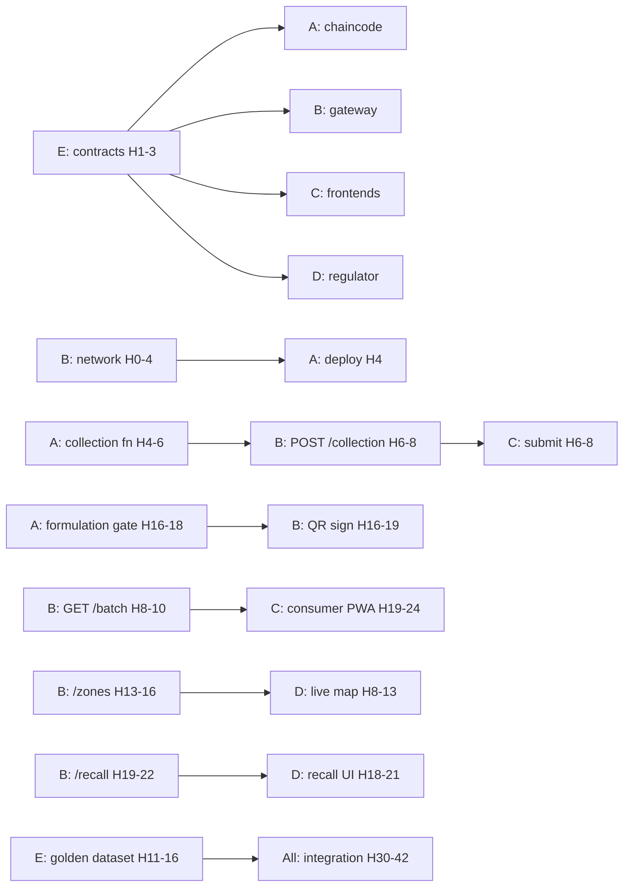

# AyurTrace — Per-Teammate Hour-by-Hour Schedule (v2)
### SmartHorizon International Hackathon · 5 people · **48-hour** window
### Companion to `AyurTrace_Execution_Plan_v2_48h.md`

> **Change from v1:** rescaled to 48h; **two-night rest rotation**; a **promotions block**
> (H24–36) for the extra time; **feature freeze at H36**; three dry runs instead of one.
>
> `[ASSUMPTION]` 48h, TypeScript, and the capability profiles below (unconfirmed). Assignments are
> by **role, not name**. Reassign per each person's end-note if your people differ.
>
> **Clock assumption for the rest model:** H0 = morning Day 1, demo ≈ H48 = morning Day 3, with
> two night windows (N1 ≈ H14–24, N2 ≈ H40–48). If your start time differs, tell me and the rest
> blocks re-derive.

---

## Overview — Who Owns What

| Person | Lane | Profile required | Milestone ownership |
|---|---|---|---|
| **A** | Ledger / Chaincode | Strongest backend; TS; hand-writes + unit-tests enforcement | M1 |
| **B** | Platform / Gateway | Most ops-comfortable; Docker, networking, Fabric SDK | M0, M2 |
| **C** | Field & Consumer UI | Frontend; React/Next; PWA/offline | M3; drives consumer demo |
| **D** | Regulator UI | Frontend; data viz; maps | M3; drives regulator demo |
| **E** | Integrator / Data / Narrative | Most versatile; contracts, seed, glue, slides; floats | M5–M7 |

**Milestones:** M0 @ H4 · M1 @ H16 · M2 @ H22 · M3 @ H30 · **M4 @ H36 (feature freeze)** ·
M5 @ H42 · M6 @ H45 · M7 @ H48.

---

## Two-Night Rest Rotation (mandatory — this is a 48h make-or-break)

~8h total each, split across two nights. **Never fewer than 2 awake. C and D (live-demo drivers)
are rested closest to the H48 demo.** Grinding the second night loses the demo.

| Person | Night 1 (5h) | Night 2 (3h) | Rationale |
|---|---|---|---|
| **C** | **H14–19** | **H44–47** | Collector flow done ~H14; rested last → fresh to drive the consumer scan |
| **E** | **H16–21** | **H41–44** | Contracts/seed done by H14; slides/integration are later |
| **A** | **H18–23** | **H40–43** | Everything others depend on done by H16–18 |
| **D** | **H21–26** | **H43–46** | Recall/map/quota done by H18; rested near demo → drives regulator |
| **B** | **H24–29** | **H40–43** | All endpoints shipped at M2 (H22); C/D integrate while B sleeps |

**Full-crew crunch: H29–40** (integration + golden path — everyone awake, the hardest stretch).
**Final push H46–48:** everyone awake, rehearsed, demo.

**Coverage sanity check:** N1 thinnest point is 2 (two devs, during post-M2 lull). N2 thinnest is
2 (the demo drivers C+D awake while others nap). The build is frozen (H36) before N2, so N2 is
rehearsal/rest, not build.

---

## Sync Points (mandatory — stops siloing)

| Hour | Sync | Gate |
|---|---|---|
| **H4** | Standup | **M0**: network up, contracts frozen, seed v1 |
| **H8** | A↔B pair-check | `POST /events/collection` commits + rejects end-to-end |
| **H16** | Team demo | **M1**: valid commit, `ZONE_VIOLATION`, `MASS_BALANCE_VIOLATION` live |
| **H22** | B hands off APIs | **M2**: C & D switch off mocks |
| **H30** | Checkpoint | **M3**: frontends real; **export-bundle go/no-go** |
| **H36** | Freeze features | **M4**: promotions done; no new features |
| **H42** | Golden-path run | **M5**: clean from `reset-demo` + failure demo |
| **H45** | Dry run #1 | **M6**: backup recording; time the pitch |
| **H48** | Freeze + demo | **M7**: 3 rehearsals done |

---

# PERSON A — Ledger / Chaincode
**Rest: H18–23 (N1), H40–43 (N2).** Finish everything others depend on before N1.

| Hours | Task | Done when | Depends on |
|---|---|---|---|
| H0–4 | Repo + chaincode skeleton; **stub-based unit-test harness** (build enforcement without waiting on the network); `ObjectEvent(commissioning)` model spec; first stub commit | Valid collection commits against stub | E freezes contracts (~H3) |
| H4–6 | Deploy `ObjectEvent` to **real network**; first real valid commit; composite keys | Real commit visible in Fauxton | B's deploy loop (M0) |
| H6–8 | **MPR check 1** (geo-fence point-in-polygon) + **check 2** (season) + unit tests | Out-of-zone→`ZONE_VIOLATION`; off-season→`SEASON_VIOLATION` | seed GeoJSON |
| H8–11 | **MPR check 3** (quota — **atomic, MVCC-safe**, keyed `species~zone~season`) + **check 4** (license) | Over-quota→`QUOTA_EXCEEDED`; no double-spend | — |
| H11–13 | **MPR check 5** (part) + **atomicity** (all-5, any fail → full rollback) + 80% quota warning | One failed check rolls back the whole tx | — |
| H13–16 | **`TransformationEvent` mass-balance** + input-link proportions; `AggregationEvent`. **→ M1** | Diluted→`MASS_BALANCE_VIOLATION`; merged lot keeps both input links | checks done |
| H16–18 | **GACP CP-7** formulation gate + `quality_test` **dual endorsement** (Lab+Regulator) + rich queries + indexes + recall-support query | Formulation blocked on failed input; 2 endorsers required | — |
| **H18–23** | **REST (N1)** | — | — |
| H23–26 | **CP-4 promotion** (drying timestamp gap < 86400s → GACP HOLD); harden all reject paths | CP-4 rejects late-dried batch | §1.2 greenlit |
| H26–30 | Support B/C/D chaincode queries; prep clean failure-injection cases; buffer | Every §6.2 code reproducible on demand | — |
| H30–40 | **Integration (crunch):** own every chaincode bug the golden path surfaces; implement the deliberate live rejects cleanly | Golden path + both failure demos hold | M3 |
| **H40–43** | **REST (N2)** | — | — |
| H43–48 | Dry runs; **lead deep technical Q&A** on chaincode; freeze at H45 | — | — |

**If A isn't this strong:** glue E onto this lane permanently from H4; drop to checks 1/3/5 +
mass-balance + CP-7; season/license → slide. Skip the CP-4 promotion.

---

# PERSON B — Platform / Infra + Gateway
**Rest: H24–29 (N1), H40–43 (N2).** Owns the two riskiest milestones (M0, M2).

| Hours | Task | Done when | Depends on |
|---|---|---|---|
| H0–1 | Clone `fabric-samples`; **test-network + CouchDB** up | Network up locally | — |
| H1–2 | Add 3rd org + **regulator read-node**; dummy tx | 4-node topology commits | — |
| H2–3 | **Prove the deploy loop** (package→install→approve→commit hello chaincode) — riskiest early task | Hello chaincode deployed | — |
| H3–4 | Infra scripts (`up`/`down`/`deploy-cc`); help A deploy real CC. **→ M0** | A deploys on demand | — |
| H4–6 | Gateway skeleton + `@hyperledger/fabric-gateway` + **CA enrollment** | Gateway connects, identities enrolled | M0 |
| H6–8 | `POST /events/collection` → chaincode; **validation layer** (§6.1). **→ H8 pair-check** | Valid submit commits; invalid→typed reject | A's collection fn |
| H8–10 | `GET /batch/:epc` from CouchDB; **error contract** (every §6.2 code typed) | Timeline reads back; rejects typed | — |
| H10–13 | aggregation/transformation/quality-test/formulation endpoints; **event listener** → status projection | All write endpoints live | A's fns |
| H13–16 | `GET /zones` + `/zones/:id/quota`; begin `POST /recall/:epc` | Zone+quota reads live | — |
| H16–19 | **QR sign + verify**; serialized signed QR minted on FormulationEvent | Valid QR verifies; copied fails | A's formulation gate (coord) |
| H19–22 | Finish `POST /recall/:epc` traversal; Postman collection; **hand APIs to C & D. → M2** | Recall returns sibling/descendant lots | — |
| H22–24 | **Real IPFS anchoring promotion** (Kubo/Pinata; real CID written on-chain via quality_test) with E | Certificate CID resolvable on-chain | §1.2 greenlit |
| **H24–29** | **REST (N1)** | — | — |
| H29–30 | Tunnel prep (cloudflared/ngrok) if doing phone-scan; endpoint hardening | Consumer PWA reachable on a phone | — |
| H30–40 | **Integration (crunch):** own **`reset-demo`** (deterministic re-seed, run 3×) + deploy stability + tunnels | `reset-demo` re-runs golden path identically | M3 |
| **H40–43** | **REST (N2)** | — | — |
| H43–48 | Dry runs; set up **backup screen recording**; freeze at H45 | — | — |

**If B has no Fabric/ops experience:** highest-risk role. Pair E with B for H0–4; if deploy loop
isn't proven by H6, **fall back to single-org test-network** and say so on stage. Drop IPFS promotion.

---

# PERSON C — Field & Consumer UI
**Rest: H14–19 (N1), H44–47 (N2 — latest, so freshest to drive the consumer scan).**

| Hours | Task | Done when | Depends on |
|---|---|---|---|
| H0–2 | Setup; review contracts; **scaffold collector-pwa + consumer-pwa (v0/Bolt)**, import to repo | Both apps render shells | contracts frozen |
| H2–4 | Collector Tier-1 form (pictographic, species/qty/part) + **Dexie offline-queue schema**. **→ M0** | Form renders; queue writes to IndexedDB | — |
| H4–6 | Offline enqueue/dequeue + sync-on-signal; client validation | Queued events persist + flush (mock) | — |
| H6–8 | Wire collector submit → real `POST /events/collection`; **reject-code UI** (§6.2 → human messages) | `ZONE_VIOLATION`→"Outside approved zone" | B's collection endpoint |
| H8–11 | GPS auto-capture + **zone-only display**; collector happy + reject paths on real API | Full collector flow works live | — |
| H11–14 | Consumer PWA scan (`@zxing/browser`) → real `GET /batch/:epc`; timeline shell with real data | Scan resolves a real batch | B's `/batch`, A's formulation data |
| **H14–19** | **REST (N1)** | — | — |
| H19–24 | Consumer PWA **full**: timeline (collection→…→formulation), **GACP 0–100**, lab values + IPFS link, DNA status, **Verified badge**, zone-level GPS, "Report a Problem"→`ConsumerFlag` | Full provenance view + badge logic correct | — |
| H24–30 | **Real Tier-2 offline-sync promotion**: queue-and-flush across a **real** network drop (not a toggle) + polish states + accessible palette + **remove all mocks. → M3** | Submit offline, kill network, restore → event syncs + tx hash returns | §1.2 greenlit |
| H30–36 | Finalize offline sync + consumer polish. **→ M4 feature freeze** | No mocks; sync demo solid | — |
| H36–44 | **Integration (crunch):** own the consumer scan golden-path moment | Scan flawless in golden path | — |
| **H44–47** | **REST (N2)** | — | — |
| H47–48 | Final rehearsal; **drive the consumer scan on stage** | — | — |

**If short on frontend hands:** consumer PWA is non-negotiable; drop the real-offline-sync promotion
back to the SIMULATED toggle before dropping anything else.

---

# PERSON D — Regulator UI
**Rest: H21–26 (N1), H43–46 (N2 — near demo, so fresh to drive the regulator story).**

| Hours | Task | Done when | Depends on |
|---|---|---|---|
| H0–2 | Setup; review contracts; **scaffold regulator app (v0/Bolt) + Tremor** | Dashboard shell renders | contracts frozen |
| H2–4 | **Leaflet + GeoJSON zones** render (mock). **→ M0** | Zones draw on map | E's GeoJSON |
| H4–8 | Tremor KPI/quota blocks; zone colour-coding (green<50/amber50–80/red>80) on mock | Map colours by quota | — |
| H8–13 | Wire real `GET /zones` + `/zones/:id/quota` (mock until B ships ~H13–16); collector leaderboard | Live quota drives map + bars | B's zone endpoints |
| H13–18 | **One-click recall UI** (mock, then B's endpoint); over-harvest alerts; batch audit trail | Recall form + result list render | B's `/recall` (H19–22) |
| H18–21 | Wire recall → real `POST /recall/:epc`; verify traversal display; quota bars live | Recall shows both source farms for a merged lot | B's recall endpoint |
| **H21–26** | **REST (N1)** | — | — |
| H26–30 | Polish; analytics stubs (mark `SLIDE-only`); responsive; accessible; remove mocks. **→ M3** | Dashboard demo-ready | — |
| H30–36 | **Export-bundle promotion** (if greenlit at M3) with E — AYUSH + EU bundle referencing tx hashes. **→ M4** | Bundle generates from a real batch | §1.2 conditional |
| H36–43 | **Integration (crunch):** own the regulator quota-move + recall golden-path moment | Quota moves; recall traces back live | — |
| **H43–46** | **REST (N2)** | — | — |
| H46–48 | Final rehearsal; **drive the regulator demo on stage** | — | — |

**If export bundle isn't greenlit:** H30–36 becomes extra dashboard polish + failure-alert states.
D's core (recall/map/quota) is done by H18 regardless.

---

# PERSON E — Integrator / Data / Narrative / Floater
**Rest: H16–21 (N1), H41–44 (N2).** Owns contracts, seed, glue, slides.

| Hours | Task | Done when | Depends on |
|---|---|---|---|
| H0–1 | Monorepo (pnpm + Turborepo); create `/packages/contracts` | Workspace builds | — |
| H1–3 | **Author frozen contracts** (§6) w/ A's review; publish `@ayurtrace/contracts` | All 5 lanes import it | A's review |
| H3–4 | **Seed data v1** (5 species incl. Ashwagandha, 3 zones + GeoJSON, quotas, 4 collectors, 1 cluster). **→ M0** | Seed loads into chaincode + Leaflet | — |
| H4–11 | **Pair with A on enforcement logic** (second pair on the highest-risk code); co-write unit tests | Each MPR check has a passing + failing test | A's progress |
| H11–16 | Build **golden-path demo dataset** (2 farms→1 merge; 1 valid + 1 zone-violation); assemble `reset-demo` seed content | Golden-path data seeds deterministically | — |
| **H16–21** | **REST (N1)** | — | — |
| H21–24 | **Real IPFS anchoring** with B (Kubo/Pinata wiring, CID pinning); begin slide skeleton | CID pins + resolves | §1.2 greenlit |
| H24–30 | **Demo script + slides** (Built-vs-Designed, architecture, golden-path storyboard); DESIGNED-as-slides (§1.4) | Deck outline + script draft | — |
| H30–36 | Export-bundle content with D (if greenlit); float to bottleneck. **→ M4** | Bundle + narrative ready | M3 |
| H36–41 | **Integration (crunch):** drive wiring; **reconcile contract drift**; script `reset-demo` with B | Golden path clean from reset | — |
| **H41–44** | **REST (N2)** | — | — |
| H44–48 | Finish slides (honesty slide, SDG/impact §9); **dry runs #1–3**; record **backup capture**; prep the 3 judge answers; who-clicks-what; freeze | Deck done; backup video exists; everyone knows their stage role | M5 |

**If E is your weakest link:** E's contract-authoring (H1–3) is load-bearing for all 5 — if E can't
do it cleanly, **A authors contracts**, E does seed + slides only, and drop the IPFS/export promotions.

---

## Cross-Lane Dependency Map

**The three hard blocks:**
1. **E's contracts (H1–3)** gate all four lanes. E does this first, nothing else.
2. **B's network (H0–4)** gates A's deploy. Not proven by H4 → A stays on stub; B+E firefight.
3. **A's formulation gate (H16–18)** gates B's QR *and* C's consumer PWA. A finishes it before N1 rest.

---

## What to tell me to make this exact
- **Names → lanes** + who has touched Fabric / Go / TS / React.
- **Your actual start time** (so N1/N2 windows land on the real nights).
- **Phone-scan demo or local-only?**
- **Export-bundle promotion** — plan it in now, or leave it as the H30 decision?
