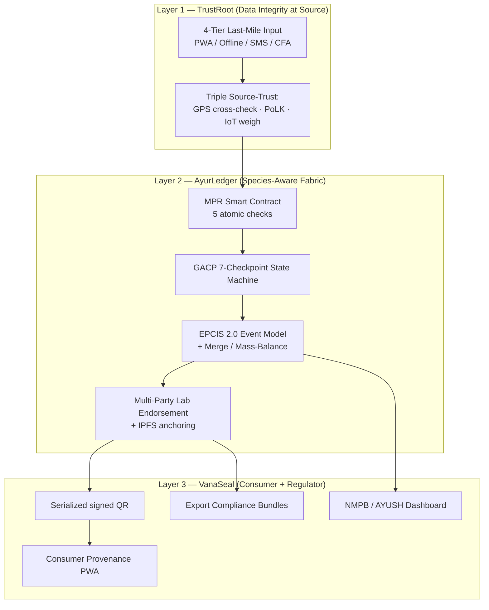
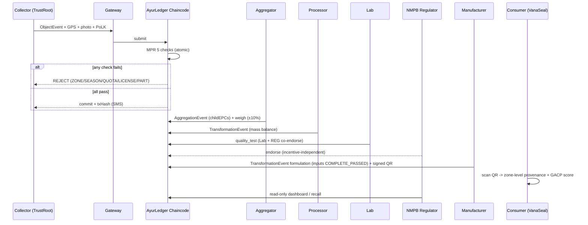

# SH-HLT-10 — AyurTrace: Complete Solution Document (v2)
### Blockchain-Based Botanical Traceability for Ayurvedic Herbs

> **Version note (v2):** This revision replaces the "structurally impossible to commit"
> framing with **"detectable, attributable, and enforced at checkpoints,"** switches the
> event schema from FHIR-style to **GS1 EPCIS 2.0** (the global supply-chain traceability
> standard), adds an explicit **merge / mass-balance model** to solve the batch-mixing
> problem, fixes the lab co-endorsement party, corrects the offline-quota contradiction,
> and separates **what we built (demo)** from **what we designed (roadmap)**.
> Assumptions introduced in this revision are tagged `[ASSUMPTION]`.

---

## Section 0 — How to Read This Document (Built vs Designed)

Every capability below is tagged:

| Tag | Meaning |
|-----|---------|
| 🟢 **BUILT** | Implemented and demonstrable live in the hackathon build |
| 🟡 **SIMULATED** | Real interface, mocked backend (clearly stated on stage) |
| 🔵 **DESIGNED** | Architected and specified, not implemented in the hackathon window |

We do not present DESIGNED components as working software. This is deliberate: a single
"that's just a mockup" catch from a judge does more damage than an honest roadmap slide.

---

## Section 1 — Problem Statement (Decoded)

India's Ayurvedic herb supply chain links smallholder farmers, wild forest collectors,
informal brokers, processing facilities, testing laboratories, and manufacturers — all
operating in isolation with no shared, tamper-evident record. Five compounding failures
result:

1. **Adulteration & mislabeling** — species substitution, dilution, and part-swapping,
   with reported species adulteration of 20–100% for certain South Indian market samples.
2. **Invisible geographic provenance** — potency, legality, and sustainability all depend
   on collection location, yet GPS origin is undocumented across most of the chain.
3. **Fragmented, mutable, non-interoperable records** — paper and unstructured digital
   files that can be backdated, altered, and cannot be linked across stages.
4. **No sustainability enforcement** — endangered species (Sarpagandha, Kutki, Jatamansi)
   over-harvested because no real-time per-zone tracking exists.
5. **Consumer-trust collapse & export barriers** — no verifiable label proof; EU/US FDA
   provenance requirements cannot be met by paperwork; recalls take weeks.

**The single root cause:** there is no continuous, tamper-evident, standardized record
connecting the moment a herb leaves the earth to the moment it enters a consumer's body.

### 1.1 The failure the original solution under-modeled: **mixing**

The problem statement's sharpest pain is brokers mixing 20 farms + 10 collectors into one
sack, after which "source information is lost forever." A pure event-log
(Collection → Custody → Processing → Formulation) does **not** capture this. Solving the
stated problem *requires* a first-class **merge event** that records N inputs → 1 output
with proportions and reconciles mass. This is now a core part of the architecture
(Section 4).

---

## Section 2 — Solution Name & Differentiator

**Solution Name:** AyurTrace — Enforcement Infrastructure for India's Ayurvedic Herb Supply Chain

**Differentiating claim (revised, defensible):**

> "Unlike generic traceability platforms (IBM Food Trust, TraceX, TE-FOOD) that log that a
> movement happened, AyurTrace encodes NMPB geo-fence zones, species-specific conservation
> quotas, and GACP checkpoints directly in chaincode — so a non-compliant collection or
> formulation is **rejected at commit time and permanently attributed to its actor**, not
> merely discovered after the fact."

**Why the wording changed:** "structurally impossible to commit" is falsifiable with one
counterexample (offline harvest, cluster collusion, off-book sale of already-cut plants).
"Detectable, attributable, and enforced at checkpoints" is the honest, still-strong claim —
and it is what the chaincode actually delivers.

---

## Section 3 — Three-Layer Architecture



---

### Layer 1 — TrustRoot (Data Integrity at Source)

**Problem it solves:** blockchain guarantees immutability *after* entry; the unsolved
problem is trustworthy entry by a semi-literate collector in a remote forest ("garbage in,
garbage out").

#### 1A — Four-Tier Last-Mile Input

| Tier | Context | Mechanism | Demo tag |
|------|---------|-----------|----------|
| **1** | Smartphone + internet | PWA, pictographic UI, regional voice input, GPS auto-capture, on-device MobileNet species photo-check, ≤90s entry | 🟢 BUILT (happy path) |
| **2** | Smartphone, no internet | Same PWA offline via IndexedDB; queued events sync on any signal; SMS confirms batch ID + tx hash | 🟡 SIMULATED (offline queue built; sync demoed on flaky-network toggle) |
| **3** | Feature phone | SMS short-code `HERB [Species] [Qty] [lat,lon] [ColID]` → Node.js+Twilio gateway parses, validates, submits on behalf | 🔵 DESIGNED (one scripted flow only in demo) |
| **4** | No device | NMPB Community Field Agent (CFA), 1 per 15–20 villages, logs on rugged tablet with collector thumb-biometric; CFA identity on-chain, revocable | 🔵 DESIGNED |

> `[ASSUMPTION]` Tier-4 biometric capture requires DPDP Act 2023 consent handling;
> treated as a roadmap compliance item, **not** demoed, to avoid a privacy-law challenge
> on stage.

#### 1B — Triple-Mechanism Source Trust (with honest limits)

**Mechanism 1 — GPS anti-spoofing (cross-signal).** Records hardware GPS + nearest
cell-tower ID; gateway flags disagreement >500m for CFA verification; timestamp-matched
site photo stored on IPFS (CID on-chain).
> **Honest limit (state it before a judge does):** EXIF GPS is editable by the same actor
> spoofing device GPS, so it is *not* independent; cell-tower cross-check degrades where
> towers are >500m away or absent (i.e. deep forest). GPS trust is therefore
> **best-effort deterrence**, not proof. The *authoritative* species check is the lab DNA
> barcode at CP-6. We say this out loud.

**Mechanism 2 — Community Proof-of-Local-Knowledge (PoLK).** Cluster of 5–15 same-zone
collectors; 2 nearest peers get anonymized (species+qty) SMS → `CONFIRM`/`DISPUTE`;
2/3 confirms → commit; dispute → PENDING + CFA within 48h.
> **Revised auto-accept rule:** no response in 4h no longer auto-*accepts* silently.
> It commits with `polkStatus = UNCONFIRMED` **and** the batch's GACP score is capped
> until a later checkpoint corroborates it. This closes the "non-response is the norm in
> forests, so everything auto-passes" hole.
> **Honest limit:** a whole cluster shares aligned economics, so PoLK does not defend
> against coordinated cluster fraud — only against a lone bad actor. DNA barcoding remains
> the backstop.

**Mechanism 3 — IoT weighbridge at aggregation.** Arriving batch re-weighed; MQTT →
gateway; chaincode compares to declared qty, ±10% tolerance for transit water loss;
>10% → HOLD + CFA inspection. RFID tag per batch auto-logs downstream custody.
> Demo tag: 🟡 SIMULATED (weight entered via mock MQTT publisher; RFID = manual batch-ID).
> We do not claim installed hardware at informal weekly *haats*.

---

### Layer 2 — AyurLedger (Species-Aware Permissioned Blockchain)

**Framework:** Hyperledger Fabric v2.5.

**Why Fabric (unchanged, correct):** permissioned (no anonymous actors), no gas fees
(high-frequency collector events), Private Data Collections (commercial terms stay between
two orgs, hash on main chain), native endorsement policies, Fabric CA for credential
lifecycle (expired NABL accreditation → cert revoked → lab can no longer write).

> `[ASSUMPTION]` Demo network is **minimized to 3 orgs + 1 regulator read-node**
> (Collector/NMPB, Accredited Lab, Manufacturer, + NMPB read-only) rather than the full
> 7 participant types. The 7-role RBAC model (Section 6) is the designed target; the
> reduced set is what runs live. Chaincode logic is identical either way.

#### 2A — Network Participants (designed target)

| Node | Org | Ledger role |
|------|-----|-------------|
| Collector / CFA | Individual / NMPB | Write `ObjectEvent(commissioning)` |
| Aggregator | Business | Write `AggregationEvent`, `ObjectEvent(weigh)` |
| Processing Facility | Business | Write `TransformationEvent(process)` |
| Accredited Lab | NABL/ISO | Write `ObjectEvent(quality_test)` |
| Manufacturer | AYUSH GMP | Write `TransformationEvent(formulation)`, QR commissioning |
| NMPB / AYUSH | Government | Read-only audit; MPR updates only |
| Consumer | Public | Read QR-resolved bundle |

#### 2B — Medicinal Plants Registry (MPR) Smart Contract — **the crown jewel** 🟢 BUILT

On every collection `ObjectEvent`, chaincode runs **five checks atomically** — any failure
rejects the whole transaction, nothing commits:

| # | Check | Reject code | Enforced against |
|---|-------|-------------|------------------|
| 1 | Geo-fence | `ZONE_VIOLATION` | GeoJSON polygon of NMPB-approved zone for species |
| 2 | Season | `SEASON_VIOLATION` | Allowed harvest window per species |
| 3 | Quota | `QUOTA_EXCEEDED` | Per-species-per-zone annual quota (atomic decrement) |
| 4 | License | `LICENSE_INVALID` | Collector NMPB registration state |
| 5 | Plant part | `PART_VIOLATION` | GACP allowed part per species |

Quota emits an 80% SMS warning to all zone collectors; 100% rejects new events until next
season.

> **Offline-quota fix (critical correctness bug in v1).** Offline events cannot decrement a
> live quota, so v1 would *reject after the plant is already cut* — creating an incentive
> to sell endangered material off-book. **Revised model:**
> - Each cluster holds a **pre-allocated soft-reserve** of quota `[ASSUMPTION: reserve = f(historical cluster harvest); tunable by NMPB]`.
> - Offline events draw against the local reserve, so a collector gets an **on-device
>   allow/deny at cut time** — the decision the field actually needs.
> - On sync, chaincode reconciles reserves against the true zone quota. Over-draw does not
>   silently pass: it commits **flagged**, decrements next season's reserve, and attributes
>   the overage to the collector.
> - We claim: over-harvest is **bounded, attributed, and self-correcting**, not "impossible."

#### 2C — GACP 7-Checkpoint State Machine 🟢 BUILT (CP-1,2,7) / 🔵 DESIGNED (CP-3,4,5,6 partial)

A batch cannot advance until required checkpoints pass; failure → `BATCH_STATUS = HOLD`.

| CP | Stage | Requirement | Chaincode enforcement |
|----|-------|-------------|-----------------------|
| CP-1 | Collection | Approved, contamination-free zone | Geo-fence vs MPR polygons |
| CP-2 | Collection | Correct part, sustainable qty | Part + quota check |
| CP-3 | Aggregation | Declared vs actual weight | IoT weigh within ±10% |
| CP-4 | Processing | Drying ≤24h of collection | Timestamp gap < 86400s |
| CP-5 | Lab | Moisture/metals/pesticide in limits | Values vs WHO/AYUSH limits |
| CP-6 | Lab | Species identity confirmed | DNA barcode ITS2 + psbA-trnH matches declared |
| CP-7 | Manufacturing | All inputs PASSED | Formulation only if every input `GACP_STATUS = COMPLETE_PASSED` |

> **DNA sampling reality (fixes the "12% → near-0%" overclaim).** Barcoding every batch is
> cost/time-prohibitive, so CP-6 is not run on 100% of batches. **Revised claim:**
> adulteration is *caught before formulation for any batch that completes all 7
> checkpoints*, with DNA applied on a **risk-weighted sample** `[ASSUMPTION: 100% for
> flagged/endangered species + export lots; statistical sample otherwise]`. We stop stating
> "near-0%" as an achieved metric and state it as a checkpoint guarantee.

#### 2D — Multi-Party Lab Endorsement — **co-signer fixed**

A `quality_test` event now requires endorsement from the **testing lab + an independent
verifier that has no incentive to pass the batch**: the **NMPB regulator node** (default),
or a **second accredited lab** for export lots.
> **Why changed:** v1 required Lab + *Manufacturer*. The manufacturer *wants* the PASS, so
> pairing them defends nothing. The whole point of dual endorsement is an
> incentive-independent second signature.

Supporting anchors (unchanged): IPFS CID of the certificate on-chain (content-derived, so
tampering changes the CID); RFC 3161 trusted timestamp for export-grade legal validity.
Demo tag: IPFS 🟡 SIMULATED (local IPFS node), RFC 3161 🔵 DESIGNED.

---

### Layer 3 — VanaSeal (Consumer + Regulator Interface)

#### 3A — Serialized Signed QR 🟢 BUILT
FormulationEvent verifies all inputs `COMPLETE_PASSED` → per-unit serialized QR, digitally
signed by manufacturer Fabric key. Copied QRs fail signature verification.

#### 3B — Consumer Provenance PWA 🟢 BUILT
Scan → instant browser view: chain timeline (collection → aggregation → processing →
testing → formulation), lab results with values + IPFS certificate link, DNA status,
GACP score 0–100, "Verified Authentic" badge (only if all 7 pass + no flags), sustainability
quota bar, "Report a Problem" → on-chain `ConsumerFlag`.
> **GPS privacy fix.** Consumers see **zone-level** location only. **Precise collection GPS
> of endangered/wild species is regulator-only** — publishing exact coordinates of a wild
> Sarpagandha site to the public is a poaching vector that would contradict our own SDG-15
> claim. Cultivated-farm precise GPS may be shown with farmer opt-in.

#### 3C — NMPB / AYUSH Regulator Dashboard 🟢 BUILT (read-only node)
Live per-zone harvest map (green <50% / amber 50–80% / red >80% quota), collector
compliance leaderboard, over-harvest alerts, batch audit trail, **one-click recall**:
enter batch ID → all finished products using it + same-collector/zone sibling batches.

#### 3D — Export Compliance Bundles 🔵 DESIGNED
Auto-generated AYUSH report + EU bundle (reg. 2023/2006 alignment) referencing tx hashes.

#### 3E — Analytics Feedback Loop 🔵 DESIGNED
Anonymized scan data → premium-price signal for high-engagement ethical clusters, recall
geo-targeting, NMPB cultivation-demand intelligence, CSIR-NBRI conservation input.

---

## Section 4 — Event Model: **GS1 EPCIS 2.0** (replaces FHIR-style)

**Why the switch.** FHIR is a *clinical* interoperability standard; using it for supply-chain
events invites the obvious judge question "why not the actual traceability standard?"
**EPCIS 2.0 (GS1, JSON-LD)** is that standard, and — decisively — its native event types map
directly onto the problem, including the mixing case v1 could not model:

| Supply-chain reality | EPCIS 2.0 event | Solves |
|----------------------|-----------------|--------|
| Herb harvested (new object) | `ObjectEvent` (bizStep `commissioning`) | Provenance origin |
| Many collector lots → one aggregator container | `AggregationEvent` (parentID + childEPCs) | Physical grouping |
| **N input batches mixed → 1 output lot** | `TransformationEvent` (inputQuantityList → outputQuantityList) | **The mixing problem** |
| Processing (dry/powder/extract) | `TransformationEvent` | Input→output linkage |
| Formulation into product | `TransformationEvent` | Product ← herb lots |
| Custody handoff | `ObjectEvent` (bizStep `shipping`/`receiving`) | Chain of custody |

### 4.1 The merge / mass-balance model (new, closes the core gap)

`TransformationEvent` carries `inputQuantityList` and `outputQuantityList`. Chaincode
enforces **mass balance** on every transformation:

```
Σ(input_kg) × (1 − declaredLossFactor)  ==  Σ(output_kg)   ± tolerance
```

- Dilution-by-volume (adding filler) breaks mass balance → `MASS_BALANCE_VIOLATION` → HOLD.
- Every output lot retains **traceable links to all input EPCs with proportions**, so
  "source lost forever" becomes "source apportioned and queryable."
- Recall from any output lot walks the input links back to every contributing
  collector/zone.
> `[ASSUMPTION]` `declaredLossFactor` per process step is seeded from NMPB/GACP
> post-harvest norms; out-of-range loss factors are themselves flagged.

### 4.2 Example — Collection `ObjectEvent` (EPCIS 2.0, JSON-LD)

```json
{
  "@context": ["https://ref.gs1.org/standards/epcis/2.0.0/epcis-context.jsonld"],
  "type": "ObjectEvent",
  "eventTime": "2026-04-15T06:47:00+05:30",
  "eventTimeZoneOffset": "+05:30",
  "action": "ADD",
  "bizStep": "commissioning",
  "disposition": "active",
  "epcList": ["urn:ayurtrace:lot:CE-KA-ASWG-2026-001234"],
  "readPoint": { "id": "urn:ayurtrace:zone:NMPB-KA-ZONE-07" },
  "quantityList": [
    { "epcClass": "urn:ayurtrace:species:ASWG", "quantity": 45.5, "uom": "KGM" }
  ],
  "ayurtrace:collectorId": "NMPB-COL-KA-8823",
  "ayurtrace:collectorCluster": "CLUSTER-TUMKUR-04",
  "ayurtrace:entryMethod": "TIER1_PWA",
  "ayurtrace:plantPart": { "submitted": "ROOT", "allowed": "ROOT", "check": "PASSED" },
  "ayurtrace:location": {
    "lat": 13.3409, "lon": 77.1018, "altitudeM": 842,
    "publicPrecision": "ZONE_ONLY",
    "geoFenceCheck": "PASSED", "cellTowerCrossCheck": "PASSED", "varianceM": 120
  },
  "ayurtrace:harvest": {
    "season": "RABI", "seasonCompliant": true,
    "quotaRemainingBeforeKg": 312.0, "quotaDeductedKg": 45.5, "quotaRemainingAfterKg": 266.5,
    "quotaSource": "CLUSTER_SOFT_RESERVE", "reconciled": true
  },
  "ayurtrace:photoEvidence": { "ipfsCID": "QmXp9...abc123", "exifGpsMatch": "PASSED" },
  "ayurtrace:polk": { "status": "CONFIRMED", "confirmations": 2, "disputes": 0 },
  "ayurtrace:mprValidation": {
    "geoFence": "PASSED", "season": "PASSED", "quota": "PASSED",
    "license": "PASSED", "plantPart": "PASSED", "overall": "ALL_PASSED"
  },
  "ayurtrace:blockchain": {
    "network": "AyurTrace-HLF-v2.5", "channel": "provenance-channel",
    "chaincode": "ayurledger-v1", "txId": "0xabc123...def456", "block": 18423,
    "endorsers": ["CollectorOrg", "NMPB-RegulatorOrg"]
  }
}
```

> Vendor-specific fields use the `ayurtrace:` namespace as EPCIS 2.0 extension properties —
> valid, interoperable, and inspectable by any GS1-aware system.

---

## Section 5 — End-to-End Flow



---

## Section 6 — Role-Based Access Control (designed target)

| Role | Write | Read | Identity |
|------|-------|------|----------|
| Collector | own collection events | own | NMPB DB + Fabric CA |
| CFA | cluster collection events | cluster | NMPB CFA registry + CA |
| Aggregator | aggregation, weigh | incoming history | Business reg + CA |
| Processor | transformation (process) | up to node | Business reg + CA |
| Lab | quality_test (co-endorsed) | assigned batch | NABL + CA |
| Manufacturer | formulation, QR | full input chain | AYUSH GMP + CA |
| NMPB | MPR updates | full network | Govt credential + CA |
| AYUSH | none | full network | Govt credential + CA |
| Consumer | none | QR bundle | none |

---

## Section 7 — Why Competitors Cannot Solve This

| Capability | AyurHerbh (SIH'25) | Generic (Food Trust/TraceX/TE-FOOD) | **AyurTrace** |
|-----------|:---:|:---:|:---:|
| MPR species rules in chaincode | ❌ | ❌ | ✅ |
| Seasonal + quota enforcement | ❌ | ❌ | ✅ |
| **EPCIS mass-balance anti-dilution** | ❌ | ⚠️ logs only | ✅ enforced |
| GACP 7-checkpoint state machine | ❌ | ❌ | ✅ |
| Incentive-independent lab co-endorse | ❌ | ❌ | ✅ |
| Attributed, bounded over-harvest control | ❌ | ❌ | ✅ |
| Zone-level GPS privacy for endangered spp. | ❌ | ❌ | ✅ |

Generic platforms track logistics movements. **AyurTrace enforces biological and regulatory
compliance and reconciles mass across mixing steps** — the two things the problem statement
actually asks for.

---

## Section 8 — Open Questions / Adoption Risk (state proactively)

1. **Broker adoption.** Brokers profit from the opaque mixing AyurTrace eliminates, so they
   have negative incentive to adopt. The 40% collector premium rewards the source end, not
   the middle. `[OPEN]` Proposed levers: manufacturer procurement mandates + NMPB licensing
   tie-in so market access, not goodwill, drives adoption. **Needs founder decision.**
2. **DNA sampling ratio** (Section 2C) — needs an NMPB-backed policy number.
3. **Cluster soft-reserve sizing** (Section 2B) — needs a real allocation formula.
4. **Tier-4 biometric consent** under DPDP Act — roadmap compliance workstream.

---

## Section 9 — Impact & SDG Alignment (claims tightened)

- **Adulteration:** caught before formulation for any batch completing all 7 checkpoints;
  DNA on a risk-weighted sample. *(No longer stated as an achieved "near-0%".)*
- **Recall:** batch-to-source in minutes via EPCIS input-link traversal.
- **Collector income:** up to 40% premium for Verified Sustainable badge holders.
- **Export docs:** manual weeks → automated bundle (DESIGNED).
- **Over-harvest:** bounded, attributed, self-correcting via soft-reserve reconciliation.

**SDGs:** 3 (health), 12 (responsible consumption), 15 (life on land). Aligns with
Atmanirbhar Bharat and the AYUSH Mission / NMPB GACP–GFCP standards.

> `[ASSUMPTION]` The ₹/$ market-size and adulteration-rate figures are carried from the
> problem-statement sources; cite them as sourced estimates, not primary measurements.
